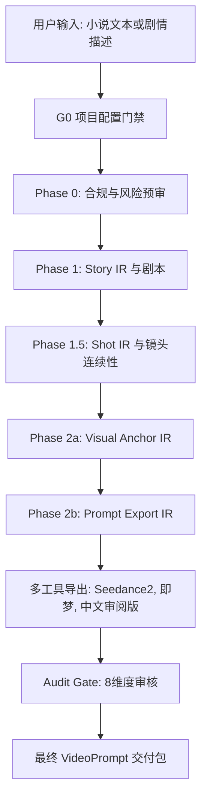

# 视频提示词工业化流水线优化设计

> 日期：2026-04-29
> 状态：设计规格
> 范围：小说文本或用户描述到最终 VideoPrompt 交付
> 不纳入范围：成片生成、配音合成、上线发布、版权证书、后期剪辑

---

## 1. 背景与目标

本项目当前定位是一个 AI 动画短剧生产规则系统，能够根据用户提供的小说文本或描述，自动生成剧本、人物清单、场景清单、分镜、人物四视图 Prompt、场景资产卡和视频提示词。

本次优化的目标不是增加成片制作能力，而是把主流程收敛到一个工业级的最终交付目标：

**输入小说文本或剧情描述，输出高质量、可审校、可多工具导出的 VideoPrompt 包。**

为了达到这个目标，主流程仍保留 Phase 2a 的人物四视图和场景资产卡，因为它们是保障角色、场景、风格和镜头连续性的必要中间资产。但这些资产不再被视为独立终局，而是作为 VideoPrompt 一致性锚点服务。

---

## 2. 当前问题诊断

### 2.1 流程目标不够收敛

现有文档中同时包含 Phase 0 到 Phase 2b 的视频提示词生成流程，也保留了 Phase 3 到 Phase 5 的成片审核、音效、版权等内容。对于当前目标来说，后续步骤会干扰主流程判断。

优化方向：

- 主流程只到 VideoPrompt 交付。
- Phase 3 到 Phase 5 从主线文档中降级为预留能力或附录。
- 审核系统保留，但作为 VideoPrompt 交付前的 Audit Gate，而不是成片阶段入口。

### 2.2 工具规则互相冲突

现有规则中同时存在以下冲突：

- `0-3s | 3-6s | 6-9s | 9-12s | 12-15s` 五段式。
- Seedance 2.0 推荐每段 4-5 秒。
- 中文提示词用于人类审阅。
- 英文提示词是 Seedance 2.0 的实际提交语言。
- 部分文档要求覆盖率 80%，部分文档要求 VideoPrompt 完整率 100%。

优化方向：

- 建立通用 Prompt Export IR。
- Seedance2、即梦、通用中文审阅版都从同一 IR 导出。
- 工具差异放到导出器规则中，不再互相争夺主流程标准。

### 2.3 Agent 职责存在重叠

现有角色边界有几个典型问题：

- 品控合规官文档写“全流程质量”，但实际只挂在 Phase 0。
- 内容总导演和镜头序列设计师都涉及情绪落幅和分镜判断。
- 美术技术总监同时负责视觉资产和最终 Prompt，工具适配职责过重。
- 审核智能体是后置附属系统，还没有成为正式门禁。

优化方向：

- 用“输入契约、输出契约、禁止越界、门禁责任”重新定义每个 agent。
- 把审核智能体纳入正式 Audit Gate。
- 把工具导出能力抽象为 Prompt 适配器模块。

### 2.4 项目示例硬编码污染通用规则

部分文档中存在固定人物数量、固定场景数量、固定角色名、固定道具等示例级检查项。这些内容适合具体项目，不适合作为通用角色规范。

优化方向：

- 通用规则只写变量和检查逻辑。
- 具体项目数量、角色名、场景名、目标工具写入 project manifest。
- 所有“12 个角色”“8 个场景”这类内容只允许出现在示例或项目配置中。

### 2.5 编排入口存在断裂

`roles/README.md` 引用了 `orchestrator-role.md`，但当前角色目录缺少该文件。编排师入口、角色定义、操作手册之间没有完整的单一事实来源。

优化方向：

- 补齐 `agents/orchestrator/roles/orchestrator-role.md`。
- 让 `orchestrator.md` 保持轻量入口。
- 让 `docs/编排师操作手册.md` 承担状态机和运行机制说明。

---

## 3. 新总体架构

新的主流程采用“中间表示驱动”的工业流水线。



核心原则：

- 最终交付只面向 VideoPrompt。
- 所有中间产物都要服务于 VideoPrompt 的质量、一致性和可导出性。
- 每个 agent 只拥有一个清晰责任域。
- 所有工具差异都通过导出器处理。
- 所有质量判断都能追踪到门禁和责任角色。

---

## 4. 中间表示设计

### 4.1 Story IR

Story IR 由内容总导演负责，是小说文本转视频提示词的叙事事实源。

必须包含：

- 项目基础信息：项目名、风格、目标平台、目标工具。
- 原文拆解：章节、段落、核心事件。
- 人物关系：角色、关系、冲突、目标、变化。
- 场景列表：场景编号、地点、时间、氛围、主要道具。
- 剧本内容：可拍摄台词、动作、旁白和场景描述。
- 情绪节拍：压强、前摇、释放、余震、转折点。
- 体量规划：目标镜头数、目标序列数、重点场景权重。

Story IR 不包含：

- 最终 VideoPrompt。
- 工具特定时间戳格式。
- 四视图 Prompt。
- 场景资产 Prompt。

### 4.2 Shot IR

Shot IR 由镜头序列设计师负责，是所有分镜和镜头连续性的事实源。

核心字段：

| 字段 | 说明 |
|---|---|
| 镜号 | 全局唯一，连续编号 |
| 场景编号 | 对应 Story IR 场景 |
| 场景类型 | 8 种场景类型之一 |
| 叙事功能 | 建立、推进、反应、转折、落幅等 |
| 主体 | 具体角色名或场景主体 |
| 动作 | 可见、可执行的动作 |
| 视线 | 眼神方向、视线落点、交互关系 |
| 景别 | Wide Shot、Medium Shot、Close-Up 等 |
| 运镜 | Dolly In、Whip Pan、Rack Focus 等 |
| 起幅 | 镜头开始时画面状态 |
| 落幅 | 镜头结束时画面状态 |
| 连续性 | 服装、光线、位置、道具、运动方向 |

Shot IR 不包含：

- 人物外貌完整 Prompt。
- 场景资产完整 Prompt。
- 工具导出格式。

### 4.3 Visual Anchor IR

Visual Anchor IR 由美术技术总监负责，是角色、场景、风格和道具的一致性事实源。

必须包含：

- 人物四视图 Prompt 包。
- 场景资产卡。
- 风格锚点。
- 道具锚点。
- 光源与色调连续性。
- 参考图映射。
- 版本映射。

关键要求：

- 人物四视图覆盖率 100%。
- 场景资产卡覆盖率 100%。
- 角色特殊标记不得遗漏。
- 场景布局必须与场景清单一致。
- 不允许具体项目示例污染通用规则。

### 4.4 Prompt Export IR

Prompt Export IR 由美术技术总监和 Prompt 适配器共同负责，是最终多工具导出的统一来源。

字段结构：

| 字段 | 说明 |
|---|---|
| shot_id | 对应 Shot IR 镜号 |
| subject_anchor | 主体锚定 |
| scene_anchor | 场景锚定 |
| action_unit | 单拍动作或微动作 |
| gaze_unit | 视线和眼神 |
| camera_unit | 景别、角度、运镜 |
| lighting_unit | 光源、色温、方向 |
| style_anchor | 风格锚点 |
| continuity | 起幅到落幅、上一镜到下一镜 |
| reference_map | AD Reference 或参考图映射 |
| negative_constraints | 负面约束 |
| tool_profiles | 目标工具导出规则 |

---

## 5. Agent 职责矩阵

### 5.1 编排师

职责：

- 接收用户任务。
- 创建项目配置。
- 调度 Phase。
- 组装输入包。
- 验证输入输出契约。
- 维护版本链。
- 处理返工路由。
- 汇总最终交付包。

禁止：

- 不生成剧本。
- 不改分镜。
- 不写 Prompt。
- 不替代审核判断。
- 不绕过门禁。

主要输出：

- 项目 manifest。
- Phase 状态记录。
- 版本映射记录。
- 返工任务清单。
- 最终交付索引。

### 5.2 品控合规官

职责：

- 平台合规检查。
- 禁用词检查。
- 格式完整性检查。
- 语言纯净度检查。
- 覆盖率检查。
- 交叉引用检查。
- 人工抽检策略。

禁止：

- 不做艺术风格裁决。
- 不重写剧本。
- 不改镜头。
- 不生成 Prompt。

边界：

- 品控合规官可以判定规则失败。
- 品控合规官不能决定某个艺术表达“好不好”。

### 5.3 内容总导演

职责：

- 小说拆解。
- 剧本改编。
- 人物关系梳理。
- 场景清单。
- 情绪节拍设计。
- 基础分镜意图。
- Story IR 维护。

禁止：

- 不生成最终 Prompt。
- 不处理工具导出格式。
- 不生成四视图。
- 不修改下游视觉锚点。

### 5.4 镜头序列设计师

职责：

- Shot IR 维护。
- 镜头序列设计。
- 轴线管理。
- 视线连续性。
- 动作方向连续性。
- 起幅与落幅设计。
- 场景类型模板应用。

禁止：

- 不改人物外貌。
- 不改场景资产。
- 不生成最终 Prompt。
- 不做全量剧情重写。

### 5.5 美术技术总监

职责：

- Visual Anchor IR。
- 人物四视图 Prompt。
- 场景资产卡。
- 风格锚点。
- 道具锚点。
- 参考图映射。
- Prompt Export IR 视觉字段。

禁止：

- 不改剧本事实。
- 不改镜头叙事功能。
- 不自行新增剧情。

### 5.6 Prompt 适配器

定位：

Prompt 适配器可以先作为 Phase 2b 内部模块存在，后续再决定是否独立成 agent。

职责：

- 从 Prompt Export IR 导出工具格式。
- 维护 Seedance2 导出规则。
- 维护即梦/豆包导出规则。
- 维护中文审阅版。
- 维护双语对照版。

禁止：

- 不改变剧情。
- 不改变镜头意图。
- 不改变角色或场景锚点。

### 5.7 审核智能体

职责：

- 作为正式 Audit Gate。
- 对最终导出包进行 8 维度审核。
- 生成 P0/P1/P2 问题。
- 将问题路由回责任 agent。

审核维度：

- 人物一致性。
- 场景一致性。
- 动作连贯性。
- 叙事逻辑。
- 表情精准度。
- 对话互动。
- 镜头语言。
- 世界观合规。

---

## 6. 质量门禁设计

### G0 项目配置门禁

检查项：

- 项目名存在。
- 输入类型明确。
- 目标平台明确。
- 目标工具明确。
- 风格已选择。
- 是否启用深度审核已确认。
- 是否启用多工具导出已确认。

输出：

- `project-manifest.md` 或 `project.yaml`。

### G1 合规门禁

责任角色：

- 品控合规官。

检查项：

- 平台合规。
- 知识产权风险。
- 敏感内容。
- AI 生成标注要求。
- 禁止内容风险。

### G2 Story IR 门禁

责任角色：

- 内容总导演。
- 品控合规官执行规则检查。

检查项：

- 剧本不是大纲。
- 台词完整。
- 人物清单完整。
- 场景清单完整。
- 情绪节拍明确。
- 无占位符。
- 无人称代词替代主要角色名。
- 有体量规划。

### G3 Shot IR 门禁

责任角色：

- 镜头序列设计师。

检查项：

- 镜号连续。
- 场景类型有效。
- 景别与运镜字段完整。
- 起幅和落幅字段完整。
- 视线关系明确。
- 轴线规则明确。
- 动作戏满足单拍单动作。
- 相邻镜头连续性可追踪。

### G4 Visual Anchor 门禁

责任角色：

- 美术技术总监。

检查项：

- 人物四视图覆盖率 100%。
- 场景资产卡覆盖率 100%。
- 角色特殊标记完整。
- 场景布局一致。
- 风格锚点一致。
- 道具锚点完整。
- 版本映射完整。

### G5 Prompt Export 门禁

责任角色：

- 美术技术总监。
- Prompt 适配器。
- 品控合规官做规则检查。

检查项：

- Prompt Export IR 字段完整。
- 每个镜头都有主体、动作、视线、环境、灯光、风格。
- 每个镜头都有负面约束。
- 每个镜头都有参考图映射策略。
- 工具导出规则正确。
- 中英文和多工具版本语义一致。

### G6 Audit Gate

责任角色：

- 审核智能体。

处理规则：

- P0 必须修复。
- P1 默认建议修复，由用户或编排策略决定。
- P2 进入优化建议，不阻断交付。

---

## 7. 高质量分镜生成规范

### 7.1 通用原则

每个镜头都必须回答 6 个问题：

1. 这个镜头推进了什么叙事？
2. 观众应该看谁或看什么？
3. 主体做了什么可见动作？
4. 主体的视线落在哪里？
5. 镜头从什么状态起幅，到什么状态落幅？
6. 与前后镜头如何连续？

### 7.2 场景类型策略

| 场景类型 | 核心策略 |
|---|---|
| 对话场景 | 轴线、正反打、视线闭环、倾听者反应 |
| 情感戏 | 情绪压强、前摇、拒绝、释放、余震 |
| 动作戏 | 单拍单动作、动势方向、物理反馈、落幅回收 |
| 悬疑惊悚 | 信息遮挡、声音先行、延迟揭示、视线落空 |
| 奇幻视觉奇观 | 能量源、尺度参照、特效阶段、光源逻辑 |
| 蒙太奇转场 | 时间压缩、匹配剪辑、节奏一致 |
| 独白内心戏 | 外化载体、微动作、环境映射 |
| 日常氛围治愈系 | 感官细节、生活动作、稳定镜头 |

### 7.3 动作戏约束

动作戏必须遵守：

- 一个镜头只写一个主要动作。
- 每个动作包含起幅、运动、落幅、回收。
- 武器、道具、身体方向必须连续。
- 大幅复杂动作优先交给镜头运动补偿，不强迫模型生成复杂连续肢体动作。

### 7.4 情绪戏约束

情绪戏必须遵守：

- 情绪不能只写标签。
- 情绪必须通过身体、表情、呼吸、视线或环境表现。
- 高压情绪必须有前摇。
- 情绪释放后必须有余震或落幅。
- 落幅载体要明确：眼睛、手、肩膀、身体、空镜等。

---

## 8. VideoPrompt 生成规范

### 8.1 通用公式

所有工具导出前，Prompt Export IR 必须按以下顺序组织：

```text
镜头/运镜 → 主体锚定 → 可执行动作 → 视线/眼神 → 环境细节 → 灯光/色调 → 风格锚点 → 负面约束 → 参考图映射
```

### 8.2 Seedance2 导出

Seedance2 导出规则：

- 英文为最终提交语言。
- 运镜和景别放在 Prompt 开头。
- 每段建议 4-5 秒。
- AD Reference 必填。
- 每个动作必须是可执行物理动作。
- 禁止抽象情绪词替代动作。
- 禁止人称代词替代角色名。
- 负面 Prompt 直接列举名词，不使用否定动词。

### 8.3 即梦/豆包导出

即梦/豆包导出规则：

- 可保留中文审阅友好结构。
- 必须包含主体、动作、视线、环境、灯光、风格字段。
- 时间分段可由工具 profile 决定。
- 不允许与 Visual Anchor IR 冲突。
- 不允许混用错误风格关键词。

### 8.4 通用中文审阅版

中文审阅版用途：

- 给用户和人工审核看。
- 检查剧情、分镜、角色一致性。
- 不直接提交给 Seedance2。

中文审阅版要求：

- 除必要专业术语外均使用简体中文。
- 保留镜头编号和连续性说明。
- 明确标出角色名、动作、视线、落幅。

### 8.5 双语对照版

双语对照版用途：

- 检查中文审阅版和英文提交版是否一致。

必须一致的字段：

- 镜头编号。
- 时间段。
- 角色名。
- 动作事件。
- 视线对象。
- 场景编号。
- 参考图编号。
- 风格锚点。

---

## 9. 覆盖率与交付标准

默认采用完整交付模式：

- Story IR 覆盖输入文本的核心剧情 100%。
- Shot IR 覆盖目标镜头规划 100%。
- Visual Anchor IR 中人物和场景覆盖率 100%。
- 最终 VideoPrompt 导出覆盖核心镜头 100%。

如果用户要求降低成本，可以启用精简交付模式，但必须显式标注：

- 哪些镜头被合并。
- 哪些镜头只保留中文审阅版。
- 哪些镜头没有导出到具体工具。
- 覆盖率是多少。

禁止默认混用 80% 和 100% 两套标准。

---

## 10. 文件改造建议

后续实施计划应覆盖以下文件：

| 文件或目录 | 改造方向 |
|---|---|
| `agents/orchestrator/orchestrator.md` | 更新主流程和最终交付边界 |
| `agents/orchestrator/roles/orchestrator-role.md` | 补齐编排师角色定义 |
| `agents/orchestrator/roles/compliance-role.md` | 改为全流程规则门禁 owner |
| `agents/orchestrator/roles/director-role.md` | 收敛到 Story IR |
| `agents/orchestrator/roles/shot-designer-role.md` | 收敛到 Shot IR |
| `agents/orchestrator/roles/art-director-role.md` | 收敛到 Visual Anchor IR 和 Prompt Export IR |
| `agents/orchestrator/phases/` | 统一输入输出契约和门禁 |
| `agents/audit/` | 纳入正式 Audit Gate |
| `rules/视频格式.md` | 改为通用 IR + 工具导出规则 |
| `rules/双轨生成.md` | 改为语言定位和对照校验规则 |
| `rules/运镜知识.md` | 移除与风格禁用词冲突的推荐词 |
| `rules/质量门禁.md` | 删除后续成片主线，聚焦 G0-G6 |
| `rules/输出验证.md` | 对齐完整交付和精简交付模式 |
| `templates/` | 新增 IR 模板和工具导出模板 |
| `docs/编排师操作手册.md` | 更新状态机、返工路由、版本链 |
| `docs/output目录结构规范.md` | 同步最终交付目录 |
| `scripts/orchestrate.sh` | 后续计划中评估是否改造 |

---

## 11. 输出目录建议

建议新的输出结构：

```text
output/{项目名}_{日期}/
├── 00-项目配置/
│   └── project-manifest.md
├── 01-Phase0-合规预审/
│   └── 合规预审报告.md
├── 02-Phase1-StoryIR/
│   ├── StoryIR.md
│   ├── 剧本.md
│   ├── 人物清单.md
│   └── 场景清单.md
├── 03-Phase1.5-ShotIR/
│   ├── ShotIR.md
│   ├── 增强分镜执行表.md
│   └── 序列衔接与继承表.md
├── 04-Phase2a-VisualAnchorIR/
│   ├── VisualAnchorIR.md
│   ├── 人物四视图Prompt包.md
│   └── 场景资产卡.md
├── 05-Phase2b-PromptExportIR/
│   └── PromptExportIR.md
├── 06-ToolExports/
│   ├── Seedance2/
│   │   └── VideoPrompt.md
│   ├── Jimeng/
│   │   └── 视频Prompt包.md
│   ├── 中文审阅版/
│   │   └── 视频Prompt包.md
│   └── 双语对照版/
│       └── VideoPrompt-对照.md
├── 07-AuditGate/
│   └── 审核报告.md
└── 99-最终交付物/
    ├── 最终VideoPrompt包.md
    ├── 交付检查清单.md
    └── 版本链.md
```

---

## 12. 返工路由

| 问题类型 | 责任角色 |
|---|---|
| 平台合规、禁用词、格式、语言纯净度 | 品控合规官 |
| 剧情缺失、台词不足、人物关系错误 | 内容总导演 |
| 轴线、视线、动作连续性、起幅落幅问题 | 镜头序列设计师 |
| 角色外貌、场景布局、风格锚点、道具锚点问题 | 美术技术总监 |
| Seedance2、即梦、中文审阅版导出格式问题 | Prompt 适配器 |
| 跨多个责任域的问题 | 编排师拆分并路由 |

返工不应默认重跑整个流程。编排师应按问题归属生成返工任务，并维护版本链。

---

## 13. 实施顺序建议

后续 implementation plan 建议按以下顺序推进：

1. 补齐编排师角色定义，统一项目目标边界。
2. 建立 IR 和门禁的总规范。
3. 重写 agent 职责边界。
4. 对齐 Phase 输入输出契约。
5. 统一视频格式、双轨生成、运镜知识、质量门禁和输出验证。
6. 调整审核智能体为正式 Audit Gate。
7. 新增 IR 模板和多工具导出模板。
8. 最后评估脚本是否需要同步改造。

---

## 14. 成功标准

本次优化完成后，应满足：

- 用户能清楚理解项目只交付到 VideoPrompt。
- 每个 agent 职责边界清晰。
- Phase 2a 保留，但定位为一致性锚点层。
- Seedance2、即梦和中文审阅版不再互相冲突。
- 分镜生成有稳定 Shot IR 支撑。
- Prompt 生成有统一 Prompt Export IR 支撑。
- 质量门禁只围绕 VideoPrompt 交付。
- 返工能按问题归属路由。
- 所有通用规范不再硬编码具体项目示例。

